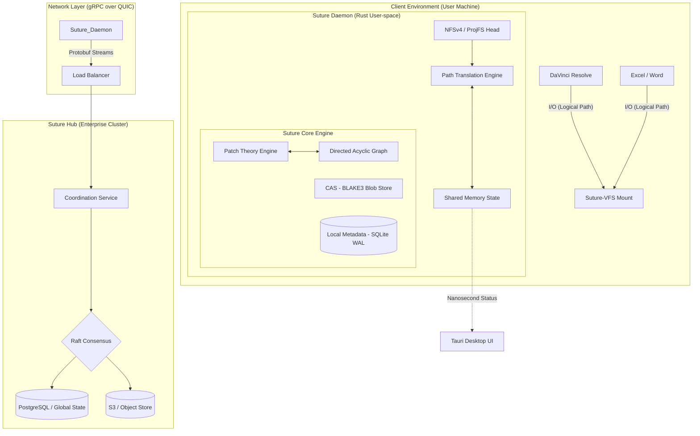

This document provides the formal architectural design and technical specification for **Suture**, a Universal Semantic Version Control System. 

---

# Suture: Architectural Design Specification v1.0

## 1. System Architecture Diagram

---

## 2. Component Specifications

### 2.1. Suture-VFS (The Virtual File System)
Unlike traditional Git, which requires files to exist physically in a `.git` managed directory, Suture uses a **Projected File System**.
*   **Logical Standard:** Every project is mounted at a virtual root (e.g., `/suture/project_alpha`).
*   **The Head:**
    *   **macOS/Linux:** An embedded NFSv4 server listening on `localhost`.
    *   **Windows:** Microsoft ProjFS (Projected File System) driver.
*   **Path Translation Engine:** Intercepts `lookup` and `open` calls. It resolves the logical path to a physical path (NAS, Cloud, or Local SSD) using an $O(1)$ hash map stored in Shared Memory (SHM).

### 2.2. The Patch Engine (Semantic Logic)
The engine moves away from snapshot-based versioning to **Operation-based versioning**.
*   **Formalism:** A project state $S$ is the result of a set of commutative patches $P$.
    *   $S_n = S_0 + \{P_1, P_2, ... P_n\}$
*   **Commutativity:** Patches are designed to be order-independent where semantic dependencies do not exist (e.g., editing Row A in Excel vs. Row B).
*   **Drivers:** Each file format requires a "Driver" that lowered the binary state into a Flatbuffers-encoded sequence of operations (e.g., `UpdateNode`, `MoveClip`, `EditCell`).

### 2.3. Storage Layer (CAS & Metadata)
*   **CAS (Content Addressable Storage):** Uses **BLAKE3** for hashing. Blobs are stored with Zstd compression. Large files (Video) are referenced via "Virtual Blobs" that point to the physical storage rather than duplicating data.
*   **Metadata DB:** SQLite in **Write-Ahead Log (WAL)** mode. This tracks the DAG, local configuration, and the "Working Set" (current checked-out files).

---

## 3. Data Flow: The "Commit" Sequence

1.  **Extraction:** The Native Panel (Resolve/Excel) triggers a commit. The **Driver** serializes the current state into an `.otio` or `.xml` IR (Intermediate Representation).
2.  **Diffing:** `libsuture` compares the IR against the current HEAD in the local SQLite DB to generate a **Patch Set**.
3.  **Hashing:** New blobs are hashed via BLAKE3 and written to the CAS.
4.  **DAG Update:** A new node is added to the local Directed Acyclic Graph.
5.  **Sync:** The Daemon initiates a gRPC stream over QUIC to the **Suture Hub**.
6.  **Coordination:** The Hub uses **Raft** to ensure the commit doesn't violate any global locks (Leases) held by other users.
7.  **Finalization:** Upon acknowledgement, the local SHM is updated, and the VFS reflects the new version across all connected clients.

---

## 4. Performance & HFT Optimization Requirements

| Metric | Target Requirement | Implementation Strategy |
| :--- | :--- | :--- |
| **Metadata Lookup** | < 500ns | Shared Memory (SHM) resident lookup tables. |
| **Hash Throughput** | > 2GB/s | SIMD-accelerated BLAKE3 implementation. |
| **Merge Latency** | < 10ms | Flatbuffers zero-copy AST traversal. |
| **Network Protocol** | QUIC (UDP) | Elimination of Head-of-Line (HOL) blocking for remote sync. |
| **Concurrency** | Lock-free | Atomic primitives for the Patch-DAG state machine. |

---

## 5. Enterprise Security Specification

### 5.1. Immutable Audit Trail
Every Patch node in the DAG is cryptographically signed using **Ed25519** keys stored in the user's secure enclave (TPM/Secure Element). The Suture Hub maintains an append-only ledger of these signatures, providing a "Proof of Authorship" that is inadmissible to tampering.

### 5.2. Distributed Lease Management (DLM)
For binary files where semantic merging is impossible (e.g., After Effects `.aep`), Suture implements a **Lease-based Lock**.
*   **Acquisition:** Client requests a lease via Raft.
*   **Heartbeat:** Client must send a UDP heartbeat every 500ms.
*   **Expiration:** If the heartbeat fails for > 2000ms, the Hub revokes the lease and marks the file as "Available/Stale," preventing project deadlocks.

---

## 6. Implementation Milestones

### Phase 1: The Foundation
*   Complete `libsuture` (Rust).
*   SQLite schema for DAG and Blob management.
*   CLI for basic `init`, `add`, `commit`.

### Phase 2: The Virtualization
*   NFSv4 User-space server implementation.
*   ProjFS implementation for Windows.
*   Dynamic path-translation logic.

### Phase 3: The Semantic Layer
*   Release of the **Suture Driver SDK**.
*   First-party drivers for **OTIO** (Resolve) and **XLSX** (Excel).

### Phase 4: The Hub
*   Raft-based `suture-coordinator`.
*   gRPC/QUIC sync protocol.
*   Web-based Visual Diff UI.